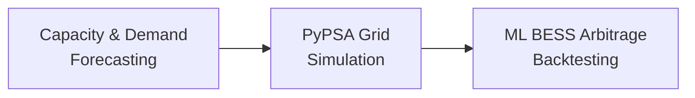

<div align="center">

# ⚡ BESS Arbitrage & Power System Simulation

### German Power Grid Digital Twin — 2030 Projection

[](https://www.python.org/)
[](https://pypsa.org/)
[](https://xgboost.readthedocs.io/)
[](#license)

A Python pipeline for modeling the German power grid, projecting renewable capacity to 2030, and evaluating ML-driven Battery Energy Storage System (BESS) arbitrage strategies.

</div>
<div align="center">

</div>
<br><br/>


<br><br/>

<br><br/>

<br><br/>

---

## Table of Contents
- [Overview](#overview)
- [Pipeline](#pipeline)
  - [1. Capacity & Demand Forecasting](#1-capacity--demand-forecasting)
  - [2. PyPSA Grid Simulation](#2-pypsa-grid-simulation)
  - [3. ML-Driven BESS Arbitrage Backtesting](#3-ml-driven-bess-arbitrage-backtesting)
- [Installation](#installation)
- [Execution Workflow](#execution-workflow)
- [Outputs](#outputs)
---
## Overview
This repository combines time-series forecasting, optimal power flow modeling, and machine learning to simulate how battery storage can arbitrage electricity prices on a 2030 German grid with high renewable penetration.
The pipeline runs in three stages, each feeding the next:

---
## Pipeline
### 1. Capacity & Demand Forecasting
| | |
|---|---|
| **Models** | ARIMA, Holt-Winters Exponential Smoothing |
| **Input** | Historical ENTSO-E generation capacity and demand data (Germany) |
| **Output** | `pypsa_capacity_2030.csv` — capacity matrix used to scale the grid model |
Predicts capacity and demand values forward to 2030.

<summary><strong>Algorithm 1: Capacity & Demand Forecasting</strong></summary>

```text
1.  Load historical generation capacity and demand from CSV files
2.  for each carrier do
3.      Fit Holt-Winters model → forecast_hw
4.      Fit ARIMA model → forecast_arima
5.      projected_capacity[carrier] ← (forecast_hw + forecast_arima) / 2
6.  Save projected_capacity and projected_demand to CSV
7.  Load projected CSV
8.  Calculate capital_cost and capital_cost_b using annuity formula
9.  for each carrier do
10.     growth_factor[carrier] ← projected_capacity[carrier] / base_capacity[carrier]
11. Load base network n_full
12. Split 2030 timeline into 12 monthly models
13. for each monthly model m do
14.     Clone base network → n_base
15.     Clone base network → n_2030
16.     Set snapshots to month m for both networks
17.     for each carrier do
18.         if carrier = load then
19.             Scale n_2030 load: p_load *= growth_factor[load]
20.         else
21.             Apply growth_factor to p_nom of matching generators/storage units in n_2030
22.     Add BESS to each AC bus in n_base with capital_cost_b
23.     Add BESS to each AC bus in n_2030 with capital_cost
24.     Define constraint: RE_gen ≥ max_RE_potential
25.     optimize(n_base)
26.     optimize(n_2030, constraint)
27.     Export solved monthly networks
28. Load January solved network as structural template
29. Add BESS static data (p_nom_opt) to annual networks
30. for each component ∈ {generators, storage_units, buses, lines, loads} do
31.     Concatenate monthly time-series attributes across all 12 months
32. Combine 12 optimised months → combined_baseline_annual.nc
33. Combine 12 optimised months → combined_2030_annual.nc
```

### 2. PyPSA Grid Simulation
| | |
|---|---|
| **Tools** | PyPSA, Gurobi solver, Linopy |
| **Input** | Baseline network (`base_s_50_elec_.nc`), 2030 capacity forecasts |
| **Output** | Combined annual + 2030 projection networks (`.nc`), `metrics_annual.csv`, LMP distributions, dispatch plots |
Scales the baseline network, adds BESS units to AC buses, enforces RE constraints, and optimizes monthly dispatch.
> **Note:** Requires an active Gurobi academic or commercial license.
### 3. ML-Driven BESS Arbitrage Backtesting
| | |
|---|---|
| **Models** | XGBoost (quantile regression), SciPy (LP oracle) |
| **Input** | Historical PyPSA network data |
| **Output** | Financial performance summaries, capture ratios, dispatch heatmaps, forecast accuracy metrics |
Trains q10/q50/q90 LMP forecasters, learns charge/discharge thresholds, and backtests dispatch against a naive persistence baseline and a perfect-foresight LP oracle.

<summary><strong>Algorithm 2: ML-Driven BESS Arbitrage Backtesting</strong></summary>

```text
1.  Load PyPSA network files for 2023, 2024, 2025
2.  Extract marginal_price, load, solar_gen_mw, onwind_gen_mw for bus DE0 1
3.  Compute price lag features: p_{t-1}, p_{t-24}, p_{t-168}
4.  Compute price rolling features: roll_mean24, roll_std24, roll_mean168, smooth_trend12
5.  Compute load lag features: l_{t-1}, l_{t-2}, l_{t-3}, l_{t-6}, l_{t-12}, l_{t-24}, l_{t-48}, l_{t-168}
6.  Split: 2023–2024 → training, 2025 → test
7.  1. Train load model via RandomizedSearchCV + TimeSeriesSplit
8.  2. Train q50 price model on absolute prices (quantile error objective, α = 0.50)
9.  3. Compute residuals: r_t ← y_t − ŷ_q50_t
10. 4. Train q05 model on r_t → lower-bound offset (α = 0.05)
11. 5. Train q95 model on r_t → upper-bound offset (α = 0.95)
12. 6. for each training window do
13.     Brute-force optimal (p_c, p_d): charge ∈ {5, 10, …, 45}, discharge ∈ {55, 60, …, 90}
14.     Record feature row → label pair (p_c, p_d)
15. 7. Train two XGBoost regressors to predict p_c and p_d from threshold_features via RandomizedSearchCV + TimeSeriesSplit
16. Clip at prediction time: p_c ∈ [5, 45], p_d ∈ [55, 90], enforce p_d ≥ p_c + 10
17. for each 24-hour test window do
18.     8. for each hour h do
19.         Predict l̂_h via load model using make_load_row()
20.         Build reg_row using make_reg_row(price_history, l̂_h)
21.         Predict ŷ_q50_h from reg_row
22.         Apply residual offsets and enforce monotonicity:
23.         ŷ_q05_h ← ŷ_q50_h + min(0, δ_q05_h)
24.         ŷ_q95_h ← ŷ_q50_h + max(0, δ_q95_h)
25.         Append ŷ_q50_h, l̂_h to history for next step
26.     9. Predict p_c, p_d from threshold models using make_threshold_row()
27.     10. for each hour h do
28.         if ŷ_q05_h ≤ percentile(ŷ_q05, p_c) and SOC < C_max then
29.             Charge BESS; update SOC
30.         else
31.             if ŷ_q95_h ≥ percentile(ŷ_q95, p_d) and SOC > 0 then
32.                 Discharge BESS; update SOC
33.             else
34.                 Idle
35.     11. Replay dispatch actions at actual prices → realized_revenue
36.     12. Compute oracle_revenue via LP lp_oracle() (HiGHS solver)
37.     13. capture_ratio ← min(realized_revenue / oracle_revenue, 1) × 100%
38.     14. Compute MAE, Spearman ρ, ranking_accuracy (k = 4, 6, 8)
39.     15. Report avg MAE, capture ratio, rank correlation, Wilcoxon signed-rank tests
```

---
## Execution Workflow
```bash
# 1. Generate the 2030 capacity forecasting matrix
python gen_proj.py
# 2. Run the PyPSA grid simulation
python 2030_sim.py   # calls run_monthly_simulations()
# 3. Train and backtest the ML arbitrage strategy
python mlbess.py
```
| Step | Script | Produces |
|---|---|---|
| 1 | Forecasting | `pypsa_capacity_2030.csv` |
| 2 | Grid Simulation | `metrics_annual.csv`, network `.nc` files, LMP plots |
| 3 | Arbitrage Backtest | Revenue summaries, capture ratios, heatmaps |
---
## Outputs
- 📊 2030 renewable capacity projections
- ⚙️ Optimized monthly dispatch networks
- 💰 BESS arbitrage revenue vs. LP oracle benchmark
- 📈 LMP forecast accuracy (q10/q50/q90)

